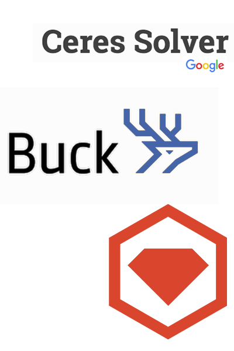
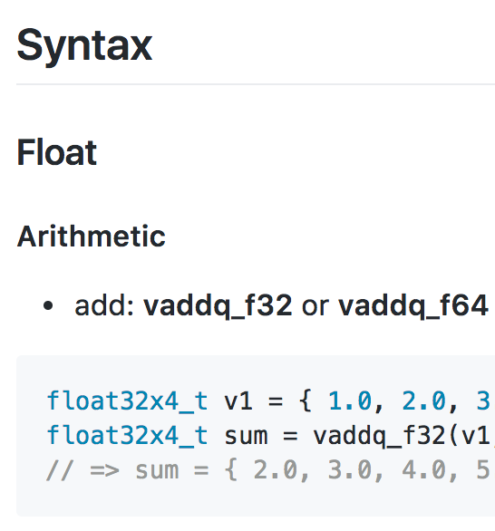
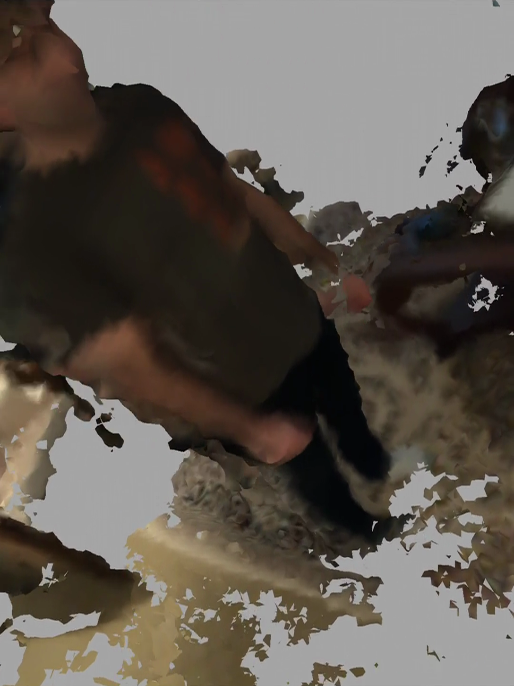

## I'm Alessandro. 

[💁‍♂️ Blog](https://medium.com/@aledalgrande) … [🙅‍♂️Twitter](https://twitter.com/aledalgrande) … [🙆‍♂️GitHub](https://github.com/aledalgrande) … [🙋‍♂️Email](mailto:adgror@gmail.com)

I create things. Lots of things, challenging things. Some in the Web, some not.

- - -

##### I contributed to Linux Debian AMD64

  

    In 2004-2005 I helped make Skype work on the first 64bit Linux distro. What a hack!
  

  

- - -

##### I helped a ton of public projects

  
  

    I worked on docs, issues and code to help the community. Including Facebook's Buck
    and Google's <a href="http://ceres-solver.org/version_history.html#id5">Ceres Solver</a>,
    the library powering Google Street Map reconstruction.
  

- - -

##### I worked on scaling apps big

  

    Whether there was the need of coming up with a real-time implementation for trending
    news used by <a href="https://itunes.apple.com/us/app/ban-jo/id417076117?mt=8">millions
    of users</a>, or speeding up page loading time, or even a test suite, I used
    code and allocations profiling and cyclomatic complexity analysis to achieve it.
  

  

- - -

##### I saved time for other developers

  
  

    From <a href="https://gist.github.com/aledalgrande/5c666f38a5ad7f77ac9dd873300c099a">tools setup</a> to <a href="https://github.com/thenifty/neon-guide">assembly coding</a> to <a href="https://medium.com/@aledalgrande/3-ways-to-make-your-web-pages-more-responsive-with-sidekiq-a3fcb1e9dcef">Web performance optimization</a>, I summarized scarce and important information into tutorials and guides that could be useful to others.
  

- - -

##### My side project is mobile computer vision

  

    I built an app that uses complex algorithms to reconstruct 3D shapes from a
    mobile phone camera, using compute kernels on the GPU.
  

  

- - -

#### I've made lots of things.

  

    I've written and shipped apps for <strong>iOS</strong>,
    <strong>APIs</strong> and full <strong>Rails</strong> apps.
  

  

    Over the last 13 years I've written 
    Web, 
    desktop, 
    terminal, and 
    client/server apps, 
    in C++, Java, PHP, Objective-C, and Ruby. 
    (And quite a few others.)
  

  

    I've experimented with grammars and parsers. I've written and played with raycasting and mesh generation. Document generators, graph databases, Web servers, native bots—I've been up to my elbows in all of them.
  

  

    Every side project I've done was because I was curious about how something worked.
  

  

    I wanted to explore it.
  

  <h3>
    I wanted to understand it.
  </h3>

## So, I learn things.

#### Quickly, and well. I want to know _why_. And then I adapt.

  

    I'm good at it. 
    Set me a task, point me at a challenge, 
    and I'll get to the bottom of it.
  

  

    Out of sheer curiosity and a desire to explore, 
    I've taught myself 
    Spanish, Japanese, 
    how to cook Michelin star dishes, 
    long running techniques, 
    clothes design, 
    patternmaking, 
    surfing.
  

  

    Then I applied what I learned, 
    but differently.
  

### Because I [learn to survive](http://videos.liftconference.com/video/1169372/jean-claude-biver-the).

# Hire me.

  

    Need to find a solution to a problem?
  

  

    Maybe another curious brain is what separates you from the solution.
  

  <h3>
    Give me a try.
  </h3>
  

    No job is too small. 
    Let's talk.
  

  

    Send a note to <a href="mailto:adgror@gmail.com">adgror@gmail.com</a>, 
    and we'll get the ball rolling.
  

  

    <em>
      Contract-only at the moment. 
      Remote offers only, please.
    </em>
  

